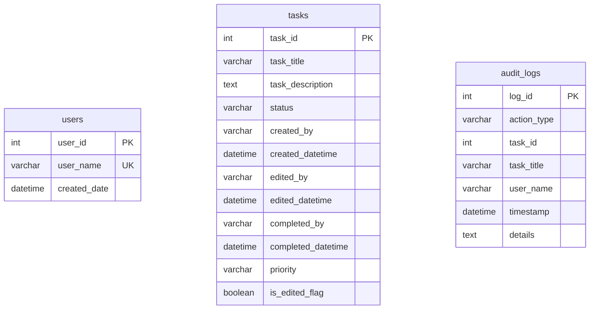

# Database Schema Documentation - TaskTracker Pro

TaskTracker Pro utilizes a single SQLite database (`tasktracker.db`) located in the root of the workspace. SQLAlchemy ORM is used to map python entities to SQLite relational tables.

---

## Entity Relationship Summary

The system is designed with a flat database structure optimized for speed, simplicity, and low-dependency deployment. Audit trails are recorded permanently across both the `tasks` and the `audit_logs` tables.

---

## 1. Table: `users`
Stores registered profiles allowed to perform operations and sign task activities.

| Field | Data Type | Constraints | Description |
|---|---|---|---|
| `user_id` | INTEGER | PRIMARY KEY, AUTOINCREMENT | Unique identifier for each profile |
| `user_name` | VARCHAR | UNIQUE, NOT NULL | Full name or profile handle of the user |
| `created_date` | DATETIME | DEFAULT (utcnow) | Date and time the profile was registered |

---

## 2. Table: `tasks`
Stores task specifications, states, and history logs.

| Field | Data Type | Constraints | Description |
|---|---|---|---|
| `task_id` | INTEGER | PRIMARY KEY, AUTOINCREMENT | Unique identifier for each task |
| `task_title` | VARCHAR | NOT NULL | Action description of the task |
| `task_description` | TEXT | NULLABLE | Contextual details, guidelines, or links |
| `status` | VARCHAR | DEFAULT 'Pending' | Current state: `'Pending'` or `'Completed'` |
| `created_by` | VARCHAR | NOT NULL | User name who added the task |
| `created_datetime` | DATETIME | DEFAULT (utcnow) | Timestamp when task was added |
| `edited_by` | VARCHAR | NULLABLE | User name who last edited the task |
| `edited_datetime` | DATETIME | NULLABLE | Timestamp of the last edit |
| `completed_by` | VARCHAR | NULLABLE | User name who marked the task complete |
| `completed_datetime` | DATETIME | NULLABLE | Timestamp of completion |
| `priority` | VARCHAR | DEFAULT 'Normal' | Priority status: `'High'`, `'Medium'`, or `'Normal'` |
| `is_edited_flag` | BOOLEAN | DEFAULT FALSE | Flag indicating if task title/description was altered |

---

## 3. Table: `audit_logs`
An immutable ledger tracking every transaction. Entries in this table are append-only.

| Field | Data Type | Constraints | Description |
|---|---|---|---|
| `log_id` | INTEGER | PRIMARY KEY, AUTOINCREMENT | Unique log entry index |
| `action_type` | VARCHAR | NOT NULL | Type of event: `'CREATE'`, `'EDIT'`, or `'COMPLETE'` |
| `task_id` | INTEGER | NOT NULL | Reference to the task ID modified |
| `task_title` | VARCHAR | NOT NULL | Copy of task title at the time of log |
| `user_name` | VARCHAR | NOT NULL | Profile name who performed the action |
| `timestamp` | DATETIME | DEFAULT (utcnow) | Transaction date and time |
| `details` | TEXT | NULLABLE | Details of changes made |

---

## Security & Compliance Rules

1. **Permanence:** Deletion queries (`DELETE FROM ...`) are not implemented anywhere in the codebase.
2. **Locking Mechanics:** If `status` evaluates to `'Completed'` in `tasks`, update queries will throw constraint failures or be blocked by code verification.
3. **Traceability:** `created_by`, `edited_by`, and `completed_by` are bound directly to user profile strings retrieved from verified session states, guaranteeing zero anonymous actions.
