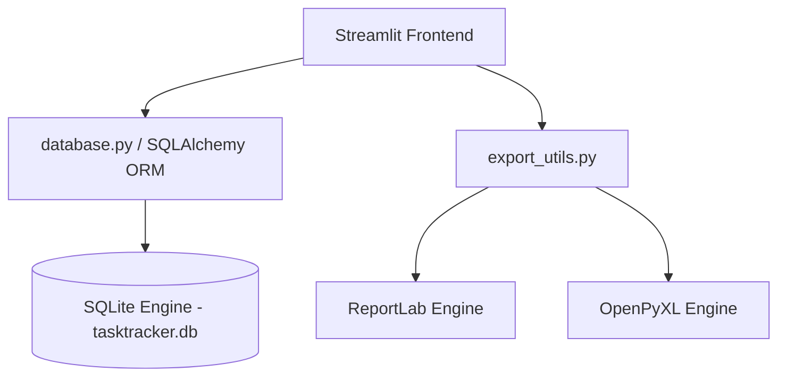
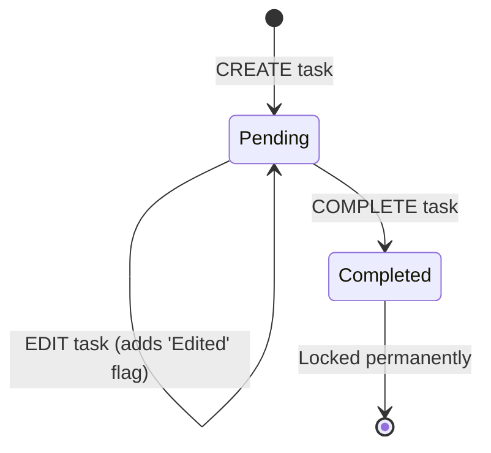

# Technical Documentation - TaskTracker Pro
> **System Architecture, Code Workflows, and Data Pipelines**

TaskTracker Pro is a modular task tracking system designed for multi-user collaboration with strict compliance auditing.

---

## 1. System Architecture

The application is structured into three layers:

- **Frontend Engine:** Python 3.12+ and Streamlit. Page routing is managed dynamically in `app.py` using `st.navigation`.
- **Database Engine:** SQLite database engine configured with SQLAlchemy ORM models.
- **Reporting Engine:** ReportLab for structured vector PDF documents and OpenPyXL for styled spreadsheet compilation.

---

## 2. Code Workflows & Logical Operations

### 2.1 State Transitions
Tasks transition strictly between two operational states:

1. **CREATE (`database.create_task`):** Instantiates a task record with status `'Pending'`. Writes an initial `'CREATE'` record to the `audit_logs` table.
2. **EDIT (`database.edit_task`):** Modifies task fields if status is `'Pending'`. Sets the `is_edited_flag` to true and logs the changed fields in `audit_logs`. If the task is `'Completed'`, the query is rejected.
3. **COMPLETE (`database.complete_task`):** Saves the `completed_by` name and `completed_datetime`, updates status to `'Completed'`, and logs a `'COMPLETE'` record in `audit_logs`. The record is now permanently locked.

---

### 2.2 Task Aging & Priority Calculations
Pending task priorities are computed dynamically at runtime using the task age (difference between current server time and the creation date):

$$\text{Age (Days)} = \text{Current Time} - \text{Created DateTime}$$

- **High Priority (🔴 Icon):** $\text{Age} \ge 7 \text{ days}$
- **Medium Priority (🟡 Icon):** $3 \text{ days} \le \text{Age} < 7 \text{ days}$
- **Normal Priority (🟢 Icon):** $\text{Age} < 3 \text{ days}$

This ensures that tasks are flagged automatically as they age, preventing them from being overlooked.

---

## 3. Data Pipelines & Export Services

Export functions are located in `components/export_utils.py`:

### 3.1 PDF Generation Pipeline (ReportLab)
1. **Document Setup:** Instantiates a `SimpleDocTemplate` specifying letter dimensions and standard 0.75-inch margins.
2. **Branding Header:** Appends title elements ("TaskTracker Pro" and "Track. Monitor. Complete.") built via ReportLab `Paragraph` flowables.
3. **KPI Table Grid:** Generates a structured cell table highlighting overall performance statistics (completion %, total, pending, completed, overdue, and monthly rates).
4. **Detailed Tasks Grid:** Maps active dataframe records into a tabular layout using `Paragraph` wrapping cells to prevent overlapping columns.
5. **Attribution Credit:** Appends Danish Zohaib credit headers.

### 3.2 Excel Export Pipeline (OpenPyXL)
1. Writes the Pandas DataFrame using the `openpyxl` engine.
2. Customizes cells by formatting fonts (Segoe UI), color-coding header fills (`#4F46E5`), centering datetime values, and drawing grid borders.
3. Computes the maximum string length per column and resizes the columns dynamically.

---

## 4. Branding Credits
Conceptualized and designed by **Danish Zohaib**. Branding headers and footers are integrated across all source files, pages, and exported documents to maintain visual cohesion.
